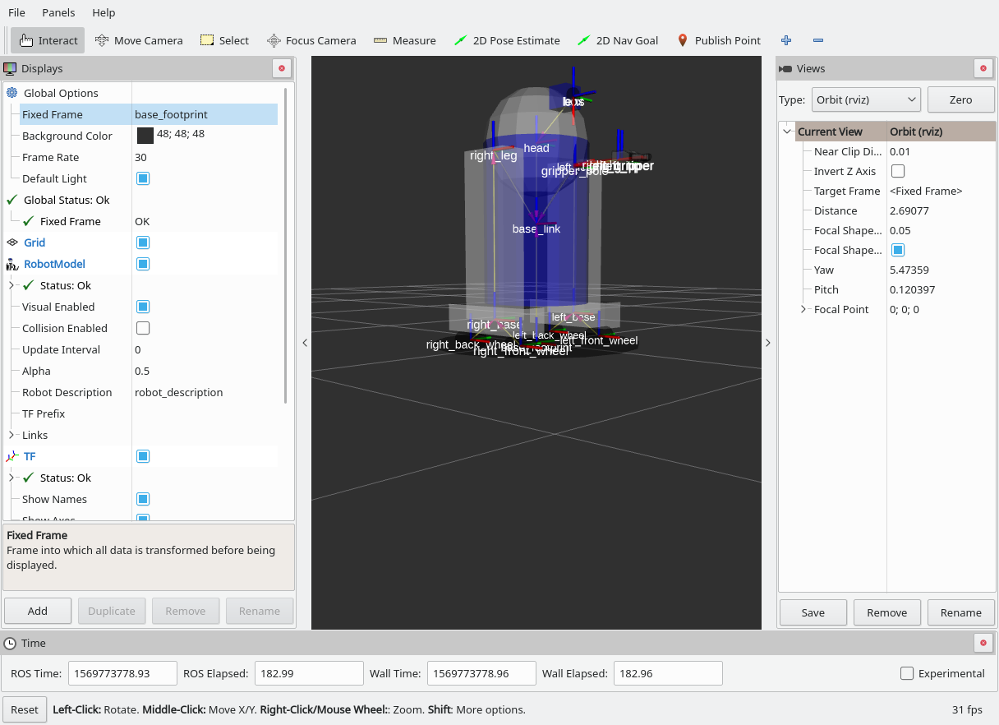

# 1

```
cat /etc/*version*
buster/sid

sudo apt-get install ros-desktop-full
sudo apt-get install ros-desktop-full-dev 


# http://wiki.ros.org/ROS/Tutorials/NavigatingTheFilesystem
rospack find roscpp
roscd roscpp
pwd
echo $ROS_PACKAGE_PATH
roscd roscpp/cmake
pwd
roscd log
rosls roscpp_tutorials


# http://wiki.ros.org/ROS/Tutorials/CreatingPackage
# http://wiki.ros.org/catkin/Tutorials/create_a_workspace

cd src
catkin_create_pkg beginner_tutorials std_msgs rospy roscpp
catkin_make
. devel/setup.bash

cd beginner_tutorials
cat package.xml
rospack depends1 rospy


# http://wiki.ros.org/ROS/Tutorials/BuildingPackages
 bash devel/setup.bash 
 catkin_make
 catkin_make install 
ls src
# output: beginner_tutorials  CMakeLists.txt
ls
# output: build  devel  install  README.md  src


# http://wiki.ros.org/ROS/Tutorials/UnderstandingNodes
roscore
# output: started core service [/rosout]
rsnode list
# output: rosnode list
rosnode info /rosout
# output: Pid: 25402


# http://wiki.ros.org/ROS/Tutorials/UnderstandingTopics
# 1. Because TurtleSim is missing, get it manually and install from: 
# 1. https://github.com/ros/ros_tutorials - use correct branch +
# 1. Add it to your src + catkin_make + bash devel/setup.bash
rosrun turtlesim turtlesim_node
rosrun turtlesim turtle_teleop_key
rostopic pub -1 /turtle1/cmd_vel geometry_msgs/Twist -- '[2.0, 0.0, 0.0]' '[0.0, 0.0, 1.8]'


# http://wiki.ros.org/ROS/Tutorials/UnderstandingServicesParams
rosservice type /clear
rosservice type /spawn | rossrv show
rosservice call /spawn 2 2 0.2 ""


# http://wiki.ros.org/ROS/Tutorials/CreatingMsgAndSrv
rosmsg show beginner_tutorials/Num
# outputs: int64 num


# http://wiki.ros.org/ROS/Tutorials/WritingPublisherSubscriber%28c%2B%2B%29
source devel/setup.bash
roscore
rosrun beginner_tutorials listener
# outputs: [ INFO] [1569183877.283433931]: I heard: [hello world 181]


# http://wiki.ros.org/ROS/Tutorials/WritingServiceClient%28c%2B%2B%29
rosrun beginner_tutorials add_two_ints_server
# output: [ INFO] [1569184427.559081738]: Ready to add two ints.

rosrun beginner_tutorials add_two_ints_client 6 6666
# output: [ INFO] [1569184474.145327913]: Sum: 6672


# http://wiki.ros.org/ROS/Tutorials/Recording%20and%20playing%20back%20data
rosbag info 2019-09-22-20-44-56.bag
# output: start:       Sep 22 2019 20:44:56.34 (1569185096.34)
rosbag play 2019-09-22-20-44-56.bag

# http://wiki.ros.org/ROS/Tutorials/Getting%20started%20with%20roswtf

```


# 2

```
# show example robot from 
# http://wiki.ros.org/urdf/Tutorials/Building%20a%20Visual%20Robot%20Model%20with%20URDF%20from%20Scratch
sudo apt-get install librospack-dev librospack0d
sudo apt-get install joint-state-publisher
catkin_create_pkg my_r2d2 joint_state_publisher
source devel/setup.bash
catkin_make
roslaunch urdf_tutorial display.launch model:='$(find urdf_tutorial)/urdf/01-myfirst.urdf'


# http://wiki.ros.org/urdf/Tutorials/Building%20a%20Visual%20Robot%20Model%20with%20URDF%20from%20Scratch
roslaunch urdf_tutorial display.launch model:='$(find my_r2d2)/urdf/r2d2.urdf'


# http://wiki.ros.org/urdf/Tutorials/Building%20a%20Movable%20Robot%20Model%20with%20URDF


# http://wiki.ros.org/urdf/Tutorials/Adding%20Physical%20and%20Collision%20Properties%20to%20a%20URDF%20Model


# http://wiki.ros.org/urdf/Tutorials/Using%20Xacro%20to%20Clean%20Up%20a%20URDF%20File
src/xacro/scripts/xacro --inorder src/my_r2d2/urdf/r2d2.urdf.xacro > src/my_r2d2/urdf/r2d2-from-xacro.urdf
roslaunch urdf_tutorial display.launch model:='$(find my_r2d2)/urdf/r2d2-from-xacro.urdf'

```


# 3

```
source devel/setup.bash
rosrun turtlesim turtlesim_node

source devel/setup.bash
rosrun turtlesim turtle_teleop_key

src/xacro/scripts/xacro --inorder src/my_r2d2/urdf/r2d2.urdf.xacro > src/my_r2d2/urdf/r2d2-from-xacro.urdf
roslaunch urdf_tutorial display.launch model:='$(find my_r2d2)/urdf/r2d2-from-xacro.urdf'

roslaunch my_r2d2 r2d2.launch

cd src
git@github.com:ut-ims-robotics/r2d2_navigator.git
rm -rf r2d2_navigator/.git
cd ..
catkin_make
# output: 
# [100%] Linking CXX executable /home/dte/Desktop/rtech/devel/lib/r2d2_navigator/fake_r2d2_controller


rosrun r2d2_navigator fake_r2d2_controller
rosnode list
rosnode info /fake_r2d2_controller
# output: /cmd_vel

rosnode list
# output: /turtlesim

rosrun turtlesim turtle_teleop_key /turtle1/cmd_vel:=/cmd_vel

```

Created base_footprint and re-positioned.




# 4

I will be using modified steps, because I have newest version of Ubuntu and ROS + I will use video, instead of camera, because I have no USB camera and it is after 23:00 in Sunday evening (too late to buy one).

```

# 0. Custom prestep. Because I have no camera, I am using video that I recorded from phone.
# https://github.com/ros-drivers/video_stream_opencv
# https://github.com/umlaeute/v4l2loopback
# https://gstreamer.freedesktop.org/documentation/tools/gst-launch.html?gi-language=c

sudo apt-get install gstreamer1.0-libav

sidp modprobe v4l2loopback devices=4
gst-launch-1.0 filesrc location=../../Downloads/IMG_0546.MOV ! qtdemux name=demux  demux.audio_0 ! queue ! decodebin ! audioconvert ! audioresample ! autoaudiosink   demux.video_0 ! queue ! decodebin ! videoconvert ! videoscale ! v4l2sink device=/dev/video0

rosrun video_stream_opencv test_video_resource.py ../../Downloads/IMG_0546.MOV
roscore

# 1. Install usb cam from
https://github.com/ros-drivers/usb_cam
roslaunch usb_cam usb_cam-test.launch

# 2. Calibrate
sudo apt-get install gtk2.0 # for next package
https://github.com/ros-perception/image_pipeline

rosrun camera_calibration cameracalibrator.py --size 8x6 --square 0.036 image:=/usb_cam/image_raw camera:=/usb_cam

# 3. Install ros-kinetic-ar-track-alvar
https://github.com/ros-perception/ar_track_alvar


```
